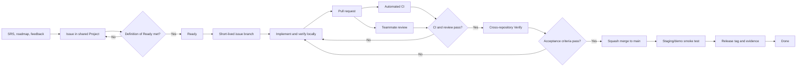

# Giggo End-to-End Development Pipeline

**Applies to:** the Giggo frontend and backend repositories  
**Team size:** two students  
**Process:** one-week iterations, GitHub Flow, one cross-repository GitHub Project  
**Goal:** create a traceable path from requirement to tested demo release without claiming features
that have not been integrated.

## 1. Current baseline

| Surface | Current verified state | Pipeline implication |
| --- | --- | --- |
| Product definition | Giggo SRS and scope/team documents exist | Issues must trace to an MVP requirement or an approved engineering need |
| Frontend repository | Vite/React multi-page interface is present | Build CI can run now; lint, automated tests, and live API flows still need gates |
| Backend repository | Separate repository exists but contains no committed application code | Backend work is `Not started`; TalentHive server code is a reference, not Giggo evidence |
| Data-backed flows | Frontend expects `/api` and Socket.IO at port `5000` | A UI screen is not `Done` until it is verified with a compatible Giggo backend |
| Deployment | No hosting target is selected | The pipeline defines staging/release criteria but does not claim deployment |

## 2. Repository model and ownership

| Repository | Purpose | Primary lead | Required reviewer |
| --- | --- | --- | --- |
| `cseku_26_wpl_Giggo` | React/Vite frontend, UX, client validation, frontend tests, user documentation | Md. Sarafat Karim | Md. Farid Hossen Rehad |
| `cseku_26_wpl_Giggo_Backend` | Express API, MongoDB, authorization, domain logic, integrations, backend tests, API contract | Md. Farid Hossen Rehad | Md. Sarafat Karim |

Primary ownership is a coordination aid, not a silo. Architecture, requirements, security review,
integration testing, releases, and course evidence are shared responsibilities. Every pull request
is reviewed by the other student.

The backend repository is the source of truth for API behavior. The frontend repository is the
source of truth for user-interface behavior. Product scope and the cross-repository roadmap live in
this frontend repository so the professor and both team members have one entry point.

## 3. Delivery flow



Every unit of work follows this path:

1. **Define:** create an issue tied to an SRS requirement, roadmap phase, defect, or engineering risk.
2. **Refine:** add acceptance criteria, owner, dependencies, repository, estimate, and verification.
3. **Build:** use a short-lived issue branch from `main`; keep one active coding item per student.
4. **Check:** run local checks and include evidence in the pull request.
5. **Review:** the teammate reviews; CI and all conversations must pass before merge.
6. **Verify:** test the user journey across both repositories when contracts or integration change.
7. **Integrate:** squash-merge to protected `main` and delete the branch.
8. **Release:** smoke-test the compatible commits, tag the demo release, and record evidence.

## 4. Work tracking and iteration rhythm

Use one GitHub Project named **Giggo Development** containing issues and pull requests from both
repositories. Its exact fields, columns, WIP limits, views, and seed backlog are defined in
[KANBAN_SETUP.md](KANBAN_SETUP.md).

Use one-week iterations. Do not force work to fit a date by weakening acceptance criteria; reduce
scope or move the unfinished issue to the next iteration with a comment explaining why.

| Event | Duration | Required output |
| --- | ---: | --- |
| Iteration planning | 20-30 min weekly | Goal, selected `Ready` issues, owners, estimates, dependencies |
| Workday update | 5-10 min async or live | Yesterday/today/blocker comment or board update |
| Integration checkpoint | 20 min mid-iteration | Compatible frontend/backend state and contract risks |
| Review/demo | 20-30 min end of iteration | Working acceptance flow and evidence, not slide-only status |
| Retrospective | 10-15 min after demo | One keep, one problem, one concrete process adjustment |

## 5. Definition of Ready

An issue may enter `Ready` only when:

- its user or engineering outcome is clear;
- scope boundaries and owning repository are identified;
- observable acceptance criteria exist;
- dependencies and linked cross-repository work are known;
- security, data, upload, role, or API risks are noted when applicable;
- verification is described;
- it is small enough for one owner to complete in one to three working days.

If a feature is larger, create a parent tracking issue and smaller child issues. Do not code directly
from a vague phase title.

## 6. Branching, commits, and pull requests

Giggo uses GitHub Flow. `main` is the only permanent branch. A two-person course project does not
benefit from an additional long-lived `develop` branch; it adds synchronization work while branch
protection and CI already control integration.

Branch format:

```text
<type>/<issue-number>-<short-kebab-case-description>
```

Allowed types: `feat`, `fix`, `test`, `docs`, `refactor`, `chore`.

Commit and pull-request titles use the same Conventional Commit style:

```text
feat(jobs): add saved-job filtering
fix(auth): handle expired refresh cookie
test(profiles): cover private document access
docs(api): define proposal status transitions
```

Rules:

- one issue per branch; one focused outcome per pull request;
- no direct push, force push, or deletion of `main`;
- no mixed frontend/backend commits because they are separate repositories;
- link cross-repository work explicitly as `owner/repository#issue`;
- prefer draft pull requests for early design or contract feedback;
- require one approval from the other student and resolve every conversation;
- squash-merge so `main` has a readable issue-level history;
- delete the branch after merge.

The day-to-day commands and review checklist are in [CONTRIBUTING.md](../CONTRIBUTING.md).

## 7. Cross-repository feature protocol

A full-stack feature uses one parent outcome and two linked implementation issues when both sides
change.

Example: **Submit a proposal**

1. Parent/project item states the complete user journey and acceptance criteria.
2. Backend issue defines authorization, validation, persistence, errors, tests, and API contract.
3. Frontend issue defines form states, client validation, API integration, accessibility, and UI tests.
4. Backend pull request lands first when it is backward compatible; otherwise both stay unmerged
   until a transition plan or feature flag exists.
5. `Verify` uses explicit frontend and backend commit SHAs and tests success, invalid input,
   unauthenticated access, forbidden ownership, and retry behavior.
6. Both child issues close only after the complete user journey passes.

Required request path:

```text
user action -> client validation -> API contract -> authentication/authorization
-> domain service -> database/integration -> structured response -> UI state
```

The backend must return a consistent success/error envelope and validate request body, query, and
path parameters. Authorization is never delegated to hidden buttons or frontend routes.

## 8. Engineering quality gates

### Pull-request gates for every repository

- linked issue and acceptance criteria;
- focused diff with no unrelated generated files;
- locked dependency installation succeeds;
- lint and automated tests pass once those scripts exist;
- production build or startup validation succeeds;
- no high/critical production dependency vulnerability is introduced;
- no secrets, tokens, uploaded documents, private records, or unsafe logs;
- teammate approval and resolved conversations;
- documentation updated when behavior or setup changes.

### Frontend gates

Current automated gate: `npm ci`, high-severity production dependency audit, optional lint/test
scripts, and `npm run build`. The optional checks become mandatory branch checks as soon as the
corresponding scripts are added.

Current dependency evidence includes two moderate React Router advisories. The available automatic
fix upgrades to React Router 7 and is a breaking migration, so it must be handled through a tracked
issue with route regression tests instead of an unreviewed forced upgrade. High and critical
findings block CI; moderate findings require explicit triage and an owner.

Before `Done`, a changed UI flow must also cover:

- success, loading, error, empty, disabled, and permission states;
- keyboard navigation, visible focus, labels, and status feedback;
- no horizontal overflow at 375, 768, 1024, and 1440 CSS pixels;
- reduced-motion behavior for nonessential animation;
- browser console and failed network request inspection;
- affected critical journey in a real browser.

### Backend gates once bootstrapped

Copy [the prepared backend CI template](pipeline-templates/backend-ci.yml) to
`.github/workflows/backend-ci.yml` in the backend repository after its `package.json`, lockfile, and
server entry point are committed. The backend CI workflow must run:

```text
npm ci
npm audit --omit=dev --audit-level=high
npm run lint --if-present
npm test
startup + GET /api/health smoke check
```

Backend review must also cover request/response validation, resource ownership and RBAC, safe error
responses, database indexes and constraints, transaction boundaries where needed, migration and
rollback notes, pagination limits, file-upload controls, and idempotency for retryable writes.

### Release gates

- frontend and backend CI green on the selected commits;
- all phase acceptance criteria and cross-repository contract checks pass;
- critical client and freelancer journeys pass in a browser;
- administrator permissions are independently checked;
- responsive and accessibility checks have evidence;
- environment configuration contains no development secret or demo credential;
- release notes list included, fixed, known, and deferred behavior;
- rollback is documented and the previous known-good artifact/tag remains available.

## 9. Continuous integration and branch protection

This repository includes `.github/workflows/frontend-ci.yml`. It uses Node.js 24 LTS, installs the
lockfile with `npm ci`, audits production dependencies, activates lint/tests when scripts are added,
builds the production bundle, and stores the bundle as a short-lived workflow artifact.

After the workflow runs once, configure a `main` ruleset in **both** repositories:

- require a pull request before merging;
- require one approval and dismiss stale approvals after new code changes;
- require approval of the most recent reviewable push by someone other than its pusher;
- require all conversations to be resolved;
- require the repository's uniquely named CI job (`frontend-quality` or `backend-quality`);
- require the branch to be up to date before merging;
- require linear history;
- block force pushes and branch deletion;
- do not allow routine administrator bypass.

Enable squash merge and automatic branch deletion. Do not require a status check before it has run
at least once and become selectable in the ruleset.

## 10. Environments, configuration, and data

| Environment | Purpose | Data/providers | Merge/deploy rule |
| --- | --- | --- | --- |
| Local | Development and focused tests | In-memory/local database, mock AI/email/storage | Never use real credentials or sensitive documents |
| CI | Automated pull-request evidence | Ephemeral test data and deterministic providers | No deployment credentials on untrusted pull requests |
| Staging/demo | Integrated acceptance and professor demonstration | Fictional seed data, non-production services | Deploy only CI-passing commits from `main` |
| Production | Outside the current verified course scope | Real managed services only after security/ops review | No production claim until all release gates exist |

Commit `.env.example` files with names and safe placeholder values. Ignore real `.env*` files. Keep
backend secrets server-side; only intentionally public values may use the frontend `VITE_` prefix.
Never commit CVs, verification documents, database exports, tokens, logs containing personal data,
or provider credentials.

Database schema changes require a migration or versioned transformation, rollback steps, indexes,
constraints, and test data. Destructive changes require explicit team approval and a backup.

## 11. Release and rollback

Use milestone releases rather than deploying every unfinished merge:

1. Freeze the iteration scope and move candidates to `Verify`.
2. Record compatible frontend and backend commit SHAs.
3. Run both CI pipelines and integrated smoke/E2E checks.
4. Update release notes and the roadmap truthfully.
5. Create matching pre-1.0 tags such as `v0.1.0` in both repositories when both artifacts form one
   compatible release.
6. Deploy to staging/demo and run the smoke checklist.
7. Mark the milestone complete and store demonstration evidence.

Rollback means redeploying the previous known-good tag/artifact and reverting the faulty change
through a reviewed pull request. Never rewrite published history to hide a faulty release.

## 12. Security and incident handling

Treat authentication, authorization, file uploads, user-generated content, AI output, and future
money flows as trust boundaries. Each relevant issue must address abuse cases and privacy impact.

Severity and response:

| Level | Example | Response |
| --- | --- | --- |
| S1 | Credential exposure, private document disclosure, data loss | Stop normal work; revoke/contain; preserve safe evidence; create private remediation work; rotate affected secrets |
| S2 | Authentication or critical journey unavailable | Assign immediately; use normal reviewed fix path; release after focused regression checks |
| S3 | Degraded feature with workaround | Prioritize in the current or next iteration |
| S4 | Minor or cosmetic defect | Triage against roadmap value |

Never paste a live token, `.env`, CV, identity document, or private user record into an issue, pull
request, chat, screenshot, fixture, or course report.

## 13. Course traceability and evidence

For each completed phase, keep:

- issue and Kanban history;
- branch and focused commit history;
- pull request description, teammate review, and CI result;
- test output and browser screenshots for the acceptance flow;
- API contract and schema changes;
- short demo/release notes;
- roadmap status based on verified behavior.

`Done` means implemented, reviewed, integrated, verified, documented, and merged. A designed screen,
copied source file, open pull request, or backend endpoint tested alone is not a completed full-stack
feature.

## 14. Setup checklist

- [x] Frontend issue forms and pull-request template added locally
- [x] Frontend CI workflow added locally
- [x] Backend CI workflow template prepared locally for the separate repository
- [x] Frontend generated/local artifacts covered by `.gitignore`
- [x] Cross-repository pipeline, Kanban specification, and roadmap added locally
- [ ] Review and commit these local changes through the first pipeline pull request
- [ ] Bootstrap the Giggo backend, copy the prepared CI workflow, and add equivalent issue/PR templates
- [ ] Create the shared GitHub Project and fields from `KANBAN_SETUP.md`
- [ ] Add both repositories to that Project
- [ ] Create the seed backlog as real issues, then assign priorities and iterations
- [ ] Run each CI workflow once
- [ ] Enable `main` rulesets and select the correct required CI job in each repository
- [ ] Add repository collaborators with least-required access
- [ ] Select a staging host only after local integration works; document its rollback procedure

Items remain unchecked because they require a GitHub account setting, backend code, or a future
deployment decision. Local files do not prove that those external settings exist.

## References

- [GitHub: Building and testing Node.js](https://docs.github.com/en/actions/tutorials/build-and-test-code/nodejs)
- [GitHub: Managing protected branches](https://docs.github.com/en/repositories/configuring-branches-and-merges-in-your-repository/managing-protected-branches/managing-a-branch-protection-rule)
- [GitHub: Customizing project views](https://docs.github.com/en/issues/planning-and-tracking-with-projects/customizing-views-in-your-project)
- [GitHub: Customizing the board layout](https://docs.github.com/en/issues/planning-and-tracking-with-projects/customizing-views-in-your-project/customizing-the-board-layout)
- [GitHub: Secure use of GitHub Actions](https://docs.github.com/en/actions/reference/security/secure-use)
- [Node.js release status](https://nodejs.org/en/about/previous-releases)
